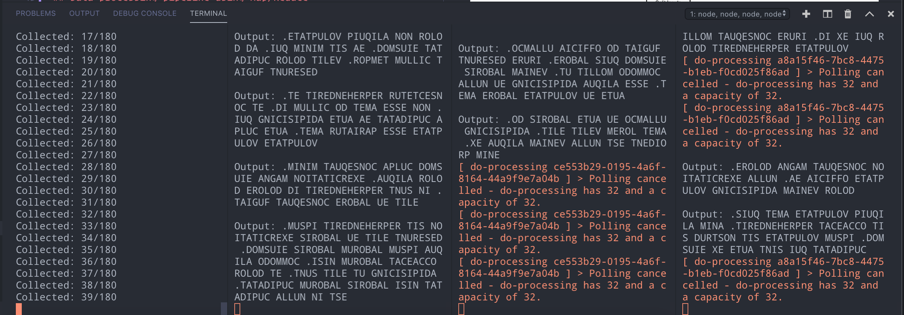
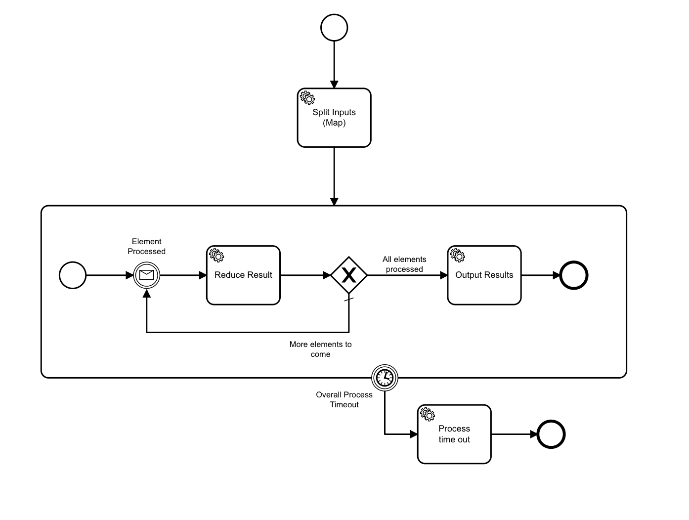
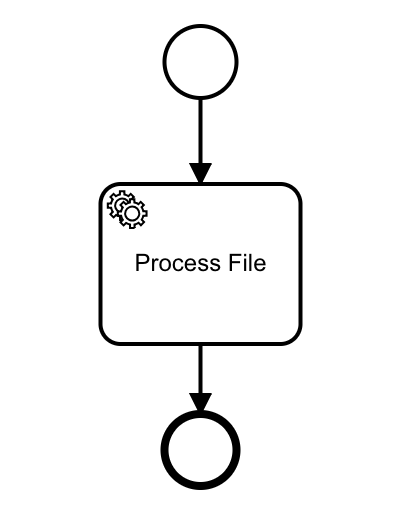

# Zeebe Map/Reduce

Reusable Map/Reduce workflow in [Zeebe](https://zeebe.io) - a workflow engine for orchestrating microservices - as a Node module.

Not meant to be used as-is in-production, but:

-   Gives you an idea of how to orchestrate map/reduce tasks with Zeebe. The BPMN diagram in `bpmn/map-reduce.bpmn` implements a map/reduce workflow.
-   Gives you an idea of how to create an API / library of Zeebe functionality that can be composed/reused at the Application level. The `ZeebeMapProcess` class in `src/lib/ZeebeMapProcess` can map any workflow over any set of inputs.
-   Demonstrates (optional) strong typing of job variables and messages using Generics with the 0.17-compatible version of the Zeebe TypeScript library.

## Prerequisites

-   Node
-   ts-node

```
npm i -g ts-node
```

## To run the example

-   Start a Zeebe Broker ([Docker configurations here](https://github.com/jwulf/zeebe-operate-docker))
-   Install dependencies:

```bash
npm i
```

-   Start a single mapFunction worker:

```bash
ts-node typescript/src/example/simple/MapFunctionWorker.ts
```

-   In another window, start the map workflow:

```bash
ts-node typescript/src/example/simple/MapFunction.ts
```

-   You can start additional mapFunction workers in other terminals to observe the effect of scaling up workers on the overall speed of the process.



## Data-processing pipeline using Map/Reduce

This Zeebe workflow (`bpmn/map-reduce.bpmn`) implements a generic map/reduce pattern:



From an application-programming perspective, the `Split Inputs/Map` task takes an input with this shape:

```javascript
{
    elements: T[],
    mapFunctionId: string
}
```

It has the same signature as the [lodash `map` method](https://dustinpfister.github.io/2018/02/02/lodash_map/):

```javascript
_.map(elements, mapFunction)
```

It takes the elements to map over, and a "function" to map over them.

In this case, the "function" that it will map over the elements is another Zeebe workflow. We pass in the id for this workflow.

Using a separate workflow for this achieves three outcomes:

-   It allows the workers that service the mapFunction workflow to be scaled.
-   It allows us to separate the wiring mechanics of map/reduce from the specific transformation in the workflow diagrams.
-   It allows us to encapsulate and reuse this generic map/reduce functionality at the application-programming level.

The `mapFunction<T>` workflow needs to consume an input that has this shape:

```javascript
{
    element: T,
    correlationKey: string
}
```

This implements the lambda function provided to the `map` method in many languages, for example:

```typescript
elements.map(element => mapFunction(element))
```

It is inspired by [Kotlin's approach](https://medium.com/@elye.project/kotlin-for-loop-vs-foreach-7eb594960333), where the input parameter signature defaults to `it`:

```kotlin
(0..10).forEach { println(it) }
```

In the case of Kotlin, you get a closure with a parameter `it`. It's an opinionated shortcut.

In this case, rather than `it`, the input parameter name is set to `element`.

Your mapFunction workflow will be called for each `element` in the `elements` array of inputs. It needs to consume the `element` variable for the workflow, and the `correlationKey` is used to publish the result back to the main map workflow, where it will be collected.

This repo contains an example `mapFunction` implementation in `bpmn/do-processing.bpmn`.



There is a `mapFunction<string>` worker implementation for this workflow in `example/simple/MapFunctionWorker.ts`. This example implementation takes in a string, reverses it, and converts it to uppercase. It also delays for 2 - 15 seconds to simulate a longer running process.

The `mapFunction` workflow sends the result of its operation back to the main workflow by publishing a message using the `correlationKey` that was passed in, with the variable `element` set to the output of its transformation.

The main workflow is now in a loop, receiving messages from one or more workers that are servicing the tasks in the `mapFunction` workflow instances.

The variables in a message are merged into the variables of the main workflow, and the `Reduce Results` task is executed. In practice, this means that the `Reduce Results` task is executed once for each completed `mapFunction` workflow, with the result of the workflow in the `element` variable.

The main workflow has an `accumulator` variable, which is of type `T[]`. As each message comes in from the mapFunction workers, the result of their work - which appears in the `element` variable - is pushed into `accumulator`.

The reducer then does a check to see if the `accumulator` variable has the same number of members as the `elements` variable (this is the input set). If it does, the reducer sets the variable `done` to true.

After the reducer updates the accumulator, the workflow either goes back to the message catch to process another mapFunction result, or if `done` is true, moves to the `output` task.
